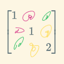

第六章 二次型
===

## 第一节

定义:$f(x_1,x_2,\cdots,x_n)=二次项组成达式$称为n元二次型,简称二次型.

题型:

- 给二次型表达式 -> 矩阵

  > 1. 平方项:系数做主对角线元素
  > 2. 交叉项:的系数除以二放到两个对称的**相应位置上**.
  >    -> 二次型矩阵一定对称

- **坑:矩阵 -> 表达式,注意看矩阵是不是对称的**.

  ### 线性替换

  $$
  \begin{align}
  f(x)&=X^TAX  	&引入线性替换X=CY\\
  	&=(CY)^T A (CY)\\
  	&=Y^T(C^TAC)Y	\\
  \end{align}
  $$

  ​	令B=C^T^AC,即为标准型[^1].

  ### 合同

  定义:A,B是n阶方阵,C是可逆矩阵,C^T^AC=B,则A,B合同,记作$A\simeq B$.

  性质:
  
  1. 反身性:$A\simeq A$
  2. 对称性:$A\simeq B$  -> $B\simeq A$.
  3. 传递性:$A \simeq B,B\simeq C$ -> $A\simeq C$.
  4. $A\simeq B$ ,则r(A)=r(B)
  5. $A\simeq B$ ,则A对称 等价于 B对称

[^1]: 只有平方项
