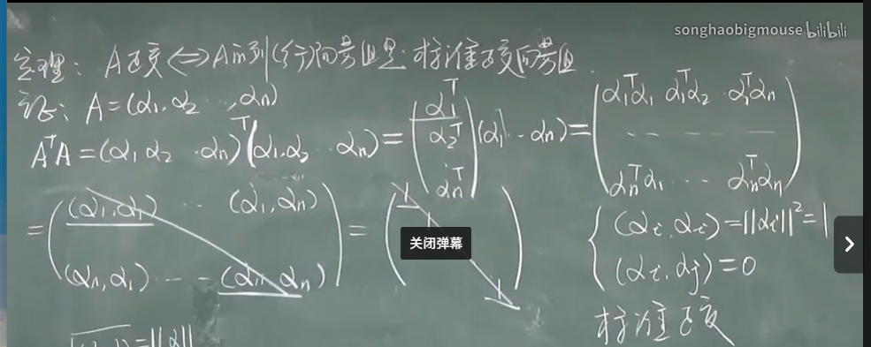
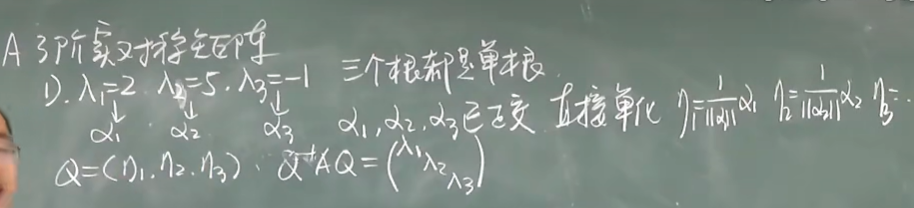

# 正交矩阵

## 概念:

定义:n阶**方阵**A,A^T^A=E .

性质:

- 正交矩阵的模为1或-1	|A^T^||A|=|E|,|A|^2^=1 
- A正交,A^-1^=A^T^.且A^-1^,A^T^均为正交矩阵.

- A,B正交,AB也正交
- A正交,有n维列向量a,b则(Aa,Ab)=(a,b)

## 定理

(1)A正交 $\Leftrightarrow$ A的列(行)向量组是标准正交向量组.

# 实对称矩阵对角化⭐

定理:实对称矩阵都能对角化.

定理:n阶实对称矩阵的特,征值是实数,特征向量也是实向量不同特征值对应的特征向量正交.

### 正交相似

定义:A,B是同阶矩阵,如果存在正交矩阵P,使得P^-1^AP=B,则称A,B正交相似.

### 实对称矩阵对角化步骤

1. 求特征值
2. 求特征向量
3. 特征向量正交化,单位化
4. 做成列,构成P

