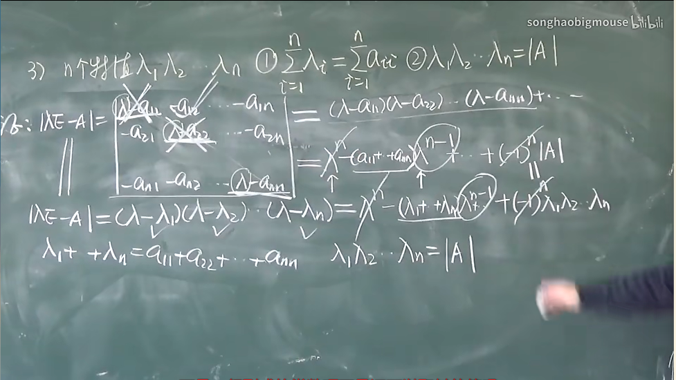
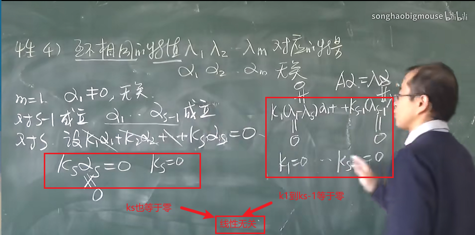
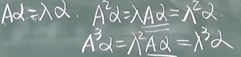
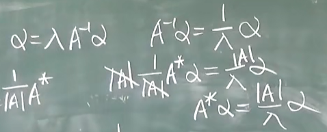

# 特征值与特征向量

### 概念

- 定义:
  - **设A是n阶方阵，如果数λ和n维非零列向量x是关系式 $Ax=\lambda x$ 成立，那么这样的数λ称为矩阵A的特征值，非零向量x称为矩阵A对应于特征值λ的一个特征向量**

### 特征值的求法

- 特征值：

  ​	将定义变形

  $$Ax=\lambda x  \Rightarrow (A-\lambda E)x=0 \Leftrightarrow 线性方程组有非零解 \Rightarrow \left| Ax-\lambda E \right| = 0$$

  ​	所以只需解出该方程组即可求出特征值

  > **注意**:	不要直接将行列式展开，最终化为因式形式
  >
  > ​		**有重根要按重根写**
  >
  > 1. 将某行极可能化为零，按行展开
  > 2. 提公因子（含有λ）
  > 3. 有相反数的可以消掉，有相同行

- 特征向量

  ​	将求到的特征值带入（Ax-λE）x=0中，解出x即为该特征值对应的特征向量

- 结论：

  - **n阶对角型举证的特征值即为主对角线上的元素**

### 求特征值、特征向量专题

#### 特征值（向量）基本性质

1.  A与A^T^具有相同的特征值（**特征向量不一定相同**）(⭐)

   $|\lambda - A^T |=|\lambda E^T - A^T|=|(\lambda E- A)^T |=|\lambda E- A|$

2. $\sum_{i=1}^{i=n}|a_{ij}|\lt1  \space 并且 \space \sum_{j=1}^{j=n}|a_{ij}|\lt 1 \space 则|\lambda_k| \lt 1$

   > 每行,每列绝对值之和小于1,则特征值的模都小于1(不重要)

3. n个特征值为$\lambda_1 \cdots,\lambda_n$,则有:(⭐⭐⭐)

   1. $\sum\lambda_i = \sum a_{ii}=tr(A)A的迹$
   2. $\lambda_1\lambda_2\cdots\lambda_n=|A|$

   

4.  **特征值不同,则对应的特征向量线性无关**(⭐)

5. K重特征根对应的线性无关的特征向量个数小于等于k

#### 其它性质:  $\lambda是A的特征值$.

1. $\Rightarrow k\lambda是kA的特征值$;
2. $\Rightarrow \lambda^k 是A^k 的特征值$;

​					.

3. $\frac{1}{\lambda}是A^{-1}的特征值$.

4. $\frac{1}{\lambda}|A|是A^*的特征值$.

   

   
