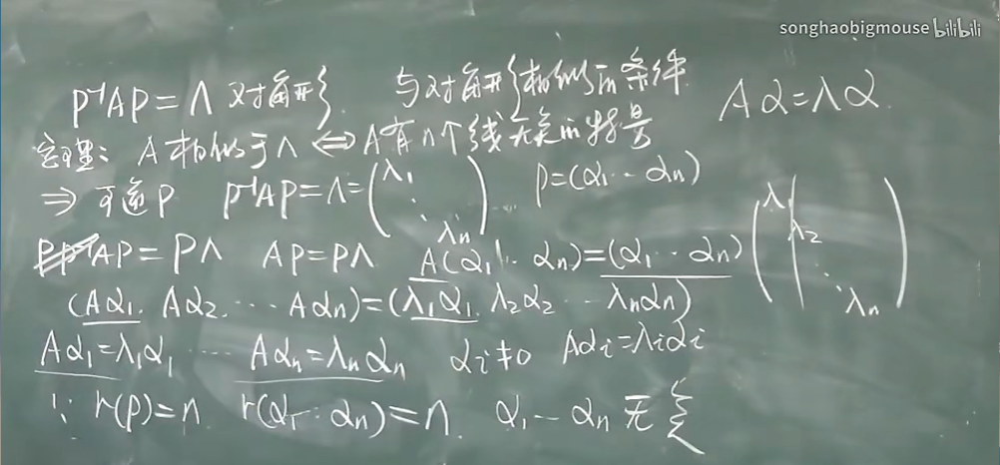

# 5.2 相似矩阵 可对角化矩阵

## (1)相似

定义:A,B是n阶方阵,若存在可逆矩阵P,s.t. P^-1^AP=B ,则称 A相似于B,记作A~B

**矩阵相似的性质:**

- 反身性:A~A;  
- 对称性:A ~ B $\rightarrow$ B ~ A
- 传递性:A~B , B~C $\rightarrow$ A~C

**相似矩阵的性质:**

- A~B,A,B有相同的**特征值**,**行列式**相等,**迹**相等. 
- A~B,A,B同时可逆或同时不可逆
- A~B, A^m^~B^m^ 

## (2)对角型矩阵

## 矩阵对角化条件

定理:n阶方阵A相似于对角型$\Leftrightarrow$A**有n个线性无关的特征向量**

$\Rightarrow$推论:A有n个互异的特征值即可(充分条件)

计算技巧:求矩阵的高次方

	1. 化为对角型 A~B,A=PBP^-1^
	1. A^n^=PB^n^P^-1^

### 实对称矩阵对角化

#### 概念:

定理:实对称矩阵都能对角化.

内积(点乘)定义:

​		$(a,b)=\begin{bmatrix}a_1\\a_2\\a_3\end{bmatrix}\cdot\begin{bmatrix}b_1\\b_2\\b_3\end{bmatrix}=a_1b_1+a_2b_2+a_3b_3$.

内积性质:

| (a,a) $\ge$ 0            |    a·a>=0    |
| :----------------------- | :----------: |
| (a,b) = (b,a)            |    ab=ba     |
| (ka,b) = (a,kb) = k(a,b) |   kab=akb    |
| (a+b,c) = (a,c)+(b,c)    | (a+b)c=ac+bc |

长度(范数,模) ||a||=$\sqrt{(a,a)}$.

正交(垂直):内积为0.

正交向量组:**不含零向量**的向量组,两两正交.

标准正交向量组:(a~i~,a~i~)=1 && (a~i~,a~j~)=0

定理:正交向量组一定线性无关(⭐)

#### 施密特正交化   ▄█▀█●

给一个线性无关向量组{a~i~},求与之等价的正交向量组{b~i~}
$$
\begin{align}
b_1 &=a_1    \\
b_2 &=a_2-\frac{(a_2,b_1)}{(b_1,b_1)}b_1	\\
b_3 &=a_3-\frac{(a_3,b_1)}{(b_1,b_1)}b_1 - \frac{(a_2,b_2)}{(b_2,b_2)}b_2\\
b_4 &= a_4-\frac{(a_4,b_1)}{(b_1,b_1)}b_1-\frac{(a_4,b_2)}{(b_2,b_2)}b_2-\frac{(a_4,b_3)}{(b_3,b_3)}b_3\\
&\cdots\cdots
\end{align}
$$
